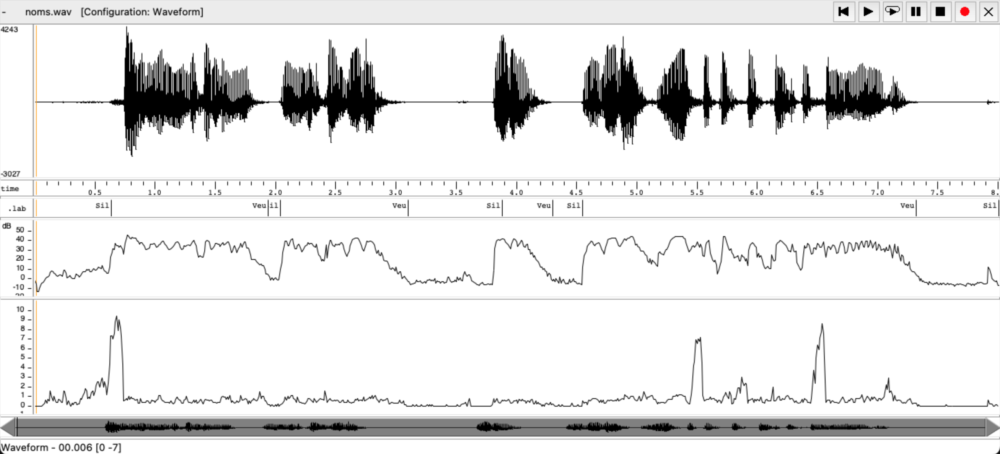
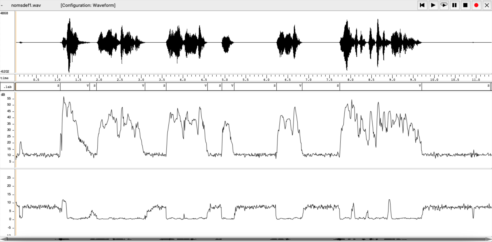
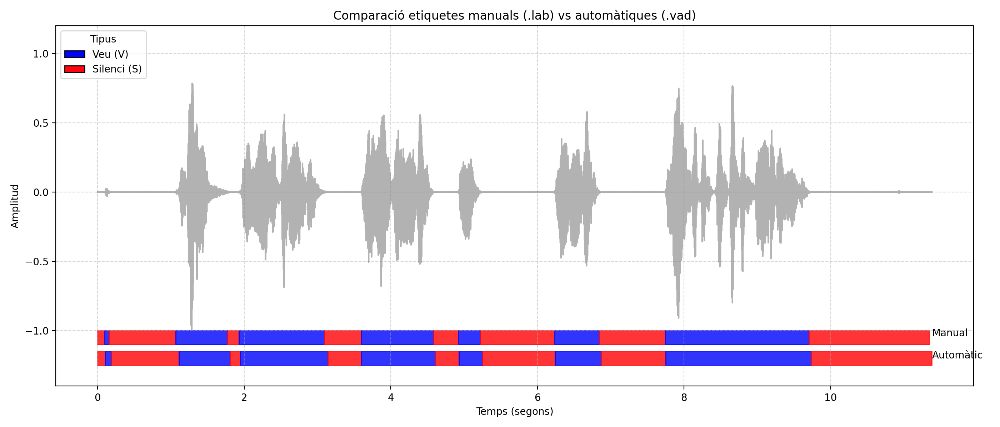
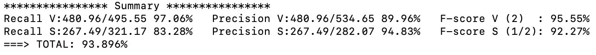
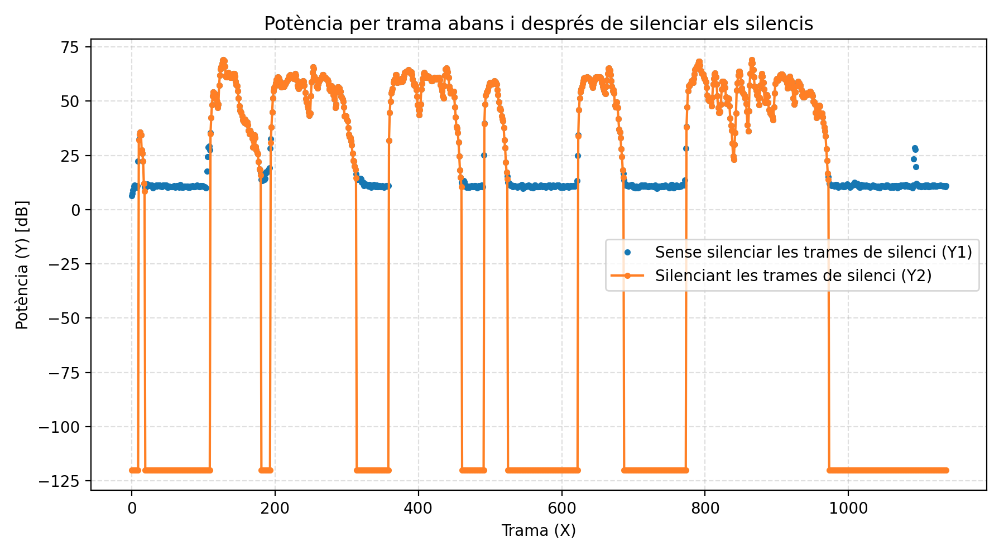
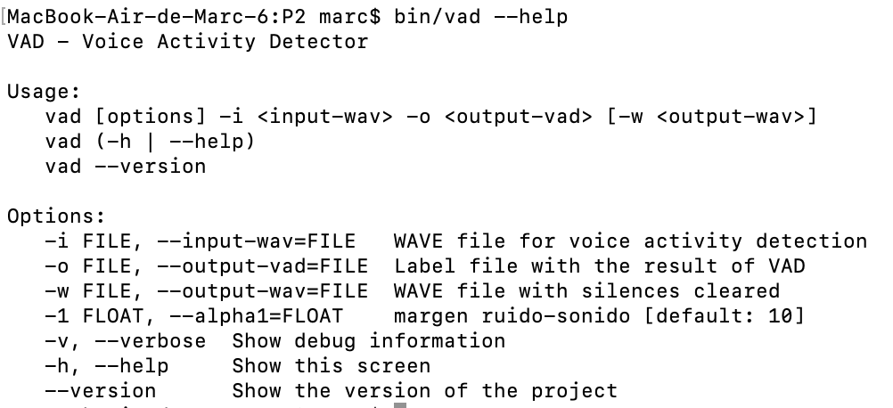

PAV - P2: detección de actividad vocal (VAD)
============================================

Ignasi Fernández Bilbeny i Marc Elvira Pallardó
-----------------------------------------------

Esta práctica se distribuye a través del repositorio GitHub [Práctica 2](https://github.com/albino-pav/P2),
y una parte de su gestión se realizará mediante esta web de trabajo colaborativo.  Al contrario que Git,
GitHub se gestiona completamente desde un entorno gráfico bastante intuitivo. Además, está razonablemente
documentado, tanto internamente, mediante sus [Guías de GitHub](https://guides.github.com/), como
externamente, mediante infinidad de tutoriales, guías y vídeos disponibles gratuitamente en internet.


Inicialización del repositorio de la práctica.
----------------------------------------------

Para cargar los ficheros en su ordenador personal debe seguir los pasos siguientes:

*	Abra una cuenta GitHub para gestionar esta y el resto de prácticas del curso.
*	Cree un repositorio GitHub con el contenido inicial de la práctica (sólo debe hacerlo uno de los
	integrantes del grupo de laboratorio, cuya página GitHub actuará de repositorio central del grupo):
	-	Acceda la página de la [Práctica 2](https://github.com/albino-pav/P2).
	-	En la parte superior derecha encontrará el botón **`Fork`**. Apriételo y, después de unos segundos,
		se creará en su cuenta GitHub un proyecto con el mismo nombre (**P2**). Si ya tuviera uno con ese 
		nombre, se utilizará el nombre **P2-1**, y así sucesivamente.
*	Habilite al resto de miembros del grupo como *colaboradores* del proyecto; de este modo, podrán
	subir sus modificaciones al repositorio central:
	-	En la página principal del repositorio, en la pestaña **:gear:`Settings`**, escoja la opción 
		**Collaborators** y añada a su compañero de prácticas.
	-	Éste recibirá un email solicitándole confirmación. Una vez confirmado, tanto él como el
		propietario podrán gestionar el repositorio, por ejemplo: crear ramas en él o subir las
		modificaciones de su directorio local de trabajo al repositorio GitHub.
*	En la página principal del repositorio, localice el botón **Branch: master** y úselo para crear
	una rama nueva con los primeros apellidos de los integrantes del equipo de prácticas separados por
	guion (**fulano-mengano**).
*	Todos los miembros del grupo deben realizar su copia local en su ordenador personal.
	-	Copie la dirección de su copia del repositorio apretando en el botón **Clone or download**.
		Asegúrese de usar *Clone with HTTPS*.
	-	Abra una sesión de Bash en su ordenador personal y vaya al directorio **PAV**. Desde ahí, ejecute:

		```.sh
		git clone dirección-del-fork-de-la-práctica
		```

	-	Vaya al directorio de la práctica `cd P2`.

	-	Cambie a la rama **fulano-mengano** con la orden:

		```.sh
		git checkout fulano-mengano
		```

*	A partir de este momento, todos los miembros del grupo de prácticas pueden trabajar en su directorio
	local del modo habitual, usando el repositorio remoto en GitHub como repositorio central para el trabajo colaborativo
	de los distintos miembros del grupo de prácticas o como copia de seguridad.
	-	Puede *confirmar* versiones del proyecto en su directorio local con las órdenes siguientes:

		```.sh
		git add .
		git commit -m "Mensaje del commit"
		```

	-	Las versiones confirmadas, y sólo ellas, se almacenan en el repositorio y pueden ser accedidas en cualquier momento.

*	Para interactuar con el contenido remoto en GitHub es necesario que los cambios en el directorio local estén confirmados.

	-	Puede comprobar si el directorio está *limpio* (es decir, si la versión actual está confirmada) usando el comando
		`git status`.

	-	La versión actual del directorio local se sube al repositorio remoto con la orden:

		```.sh
		git push
		```

		*	Si el repositorio remoto contiene cambios no presentes en el directorio local, `git` puede negarse
			a subir el nuevo contenido.

			-	En ese caso, lo primero que deberemos hacer es incorporar los cambios presentes en el repositorio
				GitHub con la orden `git pull`.

			-	Es posible que, al hacer el `git pull` aparezcan *conflictos*; es decir, ficheros que se han modificado
				tanto en el directorio local como en el repositorio GitHub y que `git` no sabe cómo combinar.

			-	Los conflictos aparecen marcados con cadenas del estilo `>>>>`, `<<<<` y `====`. Los ficheros correspondientes
				deben ser editados para decidir qué versión preferimos conservar. Un editor avanzado, del estilo de Microsoft
				Visual Studio Code, puede resultar muy útil para localizar los conflictos y resolverlos.

			-	Tras resolver los conflictos, se ha de confirmar los cambios con `git commit` y ya estaremos en condiciones
				de subir la nueva versión a GitHub con el comando `git push`.


	-	Para bajar al directorio local el contenido del repositorio GitHub hay que ejecutar la orden:

		```.sh
		git pull
		```
	
		*	Si el repositorio local contiene cambios no presentes en el directorio remoto, `git` puede negarse a bajar
			el contenido de este último.

			-	La resolución de los posibles conflictos se realiza como se explica más arriba para
				la subida del contenido local con el comando `git push`.


*	Al final de la práctica, la rama **fulano-mengano** del repositorio GitHub servirá para remitir la
	práctica para su evaluación utilizando el mecanismo *pull request*.
	-	Vaya a la página principal de la copia del repositorio y asegúrese de estar en la rama
		**fulano-mengano**.
	-	Pulse en el botón **New pull request**, y siga las instrucciones de GitHub.


Entrega de la práctica.
-----------------------

Responda, en este mismo documento (README.md), los ejercicios indicados a continuación. Este documento es
un fichero de texto escrito con un formato denominado _**markdown**_. La principal característica de este
formato es que, manteniendo la legibilidad cuando se visualiza con herramientas en modo texto (`more`,
`less`, editores varios, ...), permite amplias posibilidades de visualización con formato en una amplia
gama de aplicaciones; muy notablemente, **GitHub**, **Doxygen** y **Facebook** (ciertamente, :eyes:).

En GitHub. cuando existe un fichero denominado README.md en el directorio raíz de un repositorio, se
interpreta y muestra al entrar en el repositorio.

Debe redactar las respuestas a los ejercicios usando Markdown. Puede encontrar información acerca de su
sintáxis en la página web [Sintaxis de Markdown](https://daringfireball.net/projects/markdown/syntax).
También puede consultar el documento adjunto [MARKDOWN.md](MARKDOWN.md), en el que se enumeran los
elementos más relevantes para completar la redacción de esta práctica.

Recuerde realizar el *pull request* una vez completada la práctica.

Ejercicios
----------

### Etiquetado manual de los segmentos de voz y silencio

- Etiquete manualmente los segmentos de voz y silencio del fichero grabado al efecto. Inserte, a 
  continuación, una captura de `wavesurfer` en la que se vea con claridad la señal temporal, el contorno de
  potencia y la tasa de cruces por cero, junto con el etiquetado manual de los segmentos.



	Veiem que l'audio que vam generar a la pràctica 1 no tenia massa bona calitat i s'escoltava molt soroll, així que hem decidit grabar el mateix àudio amb un microfon millor per poder fer una bona interpretació de les gràfiques. A continuació podem observar el WaveSurfer del nou àudio amb les gràfiques corresponents. Observem que els senyals s'assemblen, quelcom lògic i, a més a més, ara les gràfiques es poden llegir millor, deixant-nos identificar bé quan hi ha veu i quan hi ha silenci.



	Hem marcat les etiquetes quan escoltem silenci com a 'S' i quan escoltem veu 'V'. Podem veure a la primera grafica l'amplitud de la senyal, a la segona les labels, a la tercera la potència del senyal i a la última el ZCR. (Si ens hi fixem, en els dos audios ho hem etiquetat igual però ara les separaciosn son diferents)


- A la vista de la gráfica, indique qué valores considera adecuados para las magnitudes siguientes:

	* Incremento del nivel potencia en dB, respecto al nivel correspondiente al silencio inicial, para
	  estar seguros de que un segmento de señal se corresponde con voz.

	Com vam comentar a classe se'ns escolta al principi de la grabació el so del clic del ratolí. 
	Es pot apreciar que, en els punts on el senyal passa de silenci a veu (o a l’inrevés), el nivell varia aproximadament de 0 dB fins a uns 45 dB. Així doncs, si prenem com a referència aquests valors inicials i verifiquem que aquesta diferència es manté al llarg de tota la resta del senyal —com efectivament passa—, podem concloure que l’augment de nivell se situa entre 40 i 45 dB.

	* Duración mínima razonable de los segmentos de voz y silencio.

	Pel que fa a la durada mínima dels segments, aquesta hauria de correspondre al temps més breu que separa dues paraules consecutives. En el nostre cas, aquest interval és aproximadament de 200 ms.

	* ¿Es capaz de sacar alguna conclusión a partir de la evolución de la tasa de cruces por cero?

	En quant a la ZCR, aquesta ens ofereix una bona manera de detectar quan apareixen al·lòfons sords dins del senyal. En el nostre exemple utilitzàvem la frase: “Som l'Ignasi Fernández i el Marc Elvira i, la vida no ha de ser perfecte per ser meravellosa.” 
	
	Tal com s’observa en la tercera gràfica, la taxa de creuaments per zero presenta pics puntuals que coincideixen amb l’aparició de consonants sordes al llarg de la frase. El primer augment notable correspon a la s inicial de “Som”, que genera un increment clar de la ZCR. A continuació, apareixen oscil·lacions més discretes associades a les s de “Ignasi” i “Fernández”, que també presenten fricació sonora. 
	
	També s’identifiquen elevacions de ZCR a la zona on es produeixen les consonants sordes de “Marc” (especialment la /k/ final). Més endavant, la p i la f de “perfecte” generen pics més pronunciats, pròxims al tram de “per”, on la p inicial torna a elevar la ZCR de manera clara. 
	
	Finalment, les fricatives sordes de “ser” i de “meravellosa” (especialment la s final) apareixen clarament reflectides en forma de petites elevacions successives al final del senyal. 
	
	En conjunt, la representació de la ZCR confirma que totes les fricatives i plosives sordes del discurs deixen una empremta clara en forma d’augment puntual de la taxa, fet que facilita l’identificació d’al·lòfons sords sense analitzar directament l’ona.


### Desarrollo del detector de actividad vocal

- Complete el código de los ficheros de la práctica para implementar un detector de actividad vocal en
  tiempo real tan exacto como sea posible. Tome como objetivo la maximización de la puntuación-F `TOTAL`.

  Tot i que es poden consultar tots els fitxers al directori corresponent, a continuació es presenten els fitxers principals que s’han modificat per assolir la màxima puntuació F-Total.  
  Considerem que el codi és prou autocontingut i que els aclariments essencials ja estan recollits mitjançant comentaris.

  · Fitxer "vad.h"
  
```c
	#ifndef _VAD_H
	#define _VAD_H
	#include <stdio.h>

	/* TODO: add the needed states */
	typedef enum {ST_UNDEF=0, ST_SILENCE, ST_VOICE, ST_INIT} VAD_STATE;

	/* Return a string label associated to each state */
	const char *state2str(VAD_STATE st);

	/* TODO: add the variables needed to control the VAD 
   (counts, thresholds, etc.) */

	typedef struct {
	VAD_STATE state;
	float sampling_rate;
	unsigned int frame_length;
	float last_feature; /* for debuggin purposes */
	float p0, p1; /* thresholds */
	/* Variables para estimar el ruido adaptativamente */
	float noise_sum;     /* suma de potencias de frames en fase INIT */
	unsigned int init_count; /* número de frames usados para estimar el ruido */
	float noise_level;   /* nivel de ruido medio (en dB) */
	float k_voice;       /* umbral para detectar voz: noise_level + (10 * α) */
	float k_silence;     /* umbral para confirmar silencio: noise_level + (3 * α) */
	float noise_zcr;     /* nivel de zcr medio */   
	float noise_zcr_sum;
	float max_power;
	float min_power;
	float max_power_real;
	float min_power_real; 

	unsigned int count_voice;   /* contador de frames que indican voz */
	unsigned int count_silence; /* contador de frames que indican silencio */

	unsigned int voice_segment_count;    // Número de segmentos de voz detectados
	unsigned int total_voice_frames;     // Total de frames clasificados como voz
	unsigned int max_silence_in_voice;   // Máxima duración de silencio encontrada en voz
	unsigned int adaptive_hangover;      // Valor adaptativo de hangover

	} VAD_DATA;

	/* Call this function before using VAD: 
	It should return allocated and initialized values of vad_data

	sampling_rate: ... the sampling rate */
	VAD_DATA *vad_open(float sampling_rate);

	/* vad works frame by frame.
	This function returns the frame size so that the program knows how
	many samples have to be provided */
	unsigned int vad_frame_size(VAD_DATA *);

	/* Main function. For each 'time', compute the new state 
	It returns:
		ST_UNDEF   (0) : undefined; it needs more frames to take decission
		ST_SILENCE (1) : silence
		ST_VOICE   (2) : voice

		x: input frame
		It is assumed the length is frame_length */
	VAD_STATE vad(VAD_DATA *vad_data, float *x, float alpha1);

	/* Free memory
	Returns the state of the last (undecided) states. */
	VAD_STATE vad_close(VAD_DATA *vad_data);

	/* Print actual state of vad, for debug purposes */
	void vad_show_state(const VAD_DATA *, FILE *);

	#endif
```

· Fitxer "vad.c"

```c  
	#include <math.h>
	#include <stdlib.h>
	#include <stdio.h>
	#include "pav_analysis.h"

	#include "vad.h"

	const float FRAME_TIME = 10.0F; /* in ms. */

	/* 
	* As the output state is only ST_VOICE, ST_SILENCE, or ST_UNDEF,
	* only this labels are needed. You need to add all labels, in case
	* you want to print the internal state in string format
	*/

	const char *state_str[] = {
	"UNDEF", "S", "V", "INIT"
	};

	const char *state2str(VAD_STATE st) {
	return state_str[st];
	}

	/* Define a datatype with interesting features */
	typedef struct {
	float zcr;
	float p;
	float am;
	} Features;

	/* 
	* TODO: Delete and use your own features!
	*/

	Features compute_features(const float *x, int N, int fm) {
	/*
	* Input: x[i] : i=0 .... N-1 
	* Ouput: computed features
	*/
	/* 
	* DELETE and include a call to your own functions
	*
	* For the moment, compute random value between 0 and 1 
	*/
	Features feat;
	/*feat.zcr = feat.p = feat.am = (float) rand()/RAND_MAX;*/

	feat.p = compute_power(x, N);
	feat.zcr = compute_zcr(x, N, fm);
	feat.am = compute_am(x, N);

	return feat;
	}

	/* 
	* TODO: Init the values of vad_data
	*/

	VAD_DATA * vad_open(float rate) {
	VAD_DATA *vad_data = malloc(sizeof(VAD_DATA));
	vad_data->state = ST_INIT;
	vad_data->sampling_rate = rate;
	vad_data->frame_length = rate * FRAME_TIME * 1e-3;
	/* Inicialización de parámetros adaptativos */
	vad_data->noise_sum = 0.0;
	vad_data->noise_zcr_sum = 0.0;  // Nuevo campo
	vad_data->init_count = 0;
	vad_data->noise_level = -100.0;  /* Valor inicial muy bajo */
	vad_data->k_voice = -40.0;  
	vad_data->k_silence = -50.0;
	
	vad_data->last_feature = 0.0;
	vad_data->p0 = 5;  /* Valor por defecto de α, ya se cambia luego */
	vad_data->count_voice = 0;
	vad_data->count_silence = 0;  // Inicialización del hangover
	vad_data->voice_segment_count = 0;
	vad_data->total_voice_frames = 0;
	vad_data->max_silence_in_voice = 0;
	vad_data->adaptive_hangover = 5;  // Valor inicial
		// In vad_open function
	vad_data->max_power = 0.0;       // Start with reasonable values
	vad_data->min_power = -100.0; 
	vad_data->max_power_real = -60.0;       // Start with reasonable values
	vad_data->min_power_real = -30.0; 
	return vad_data;
	}

	VAD_STATE vad_close(VAD_DATA *vad_data) {
	/* 
	* TODO: decide what to do with the last undecided frames
	*/
	VAD_STATE state = vad_data->state;

	free(vad_data);
	return state;
	}

	unsigned int vad_frame_size(VAD_DATA *vad_data) {
	return vad_data->frame_length;
	}

	/* 
	* TODO: Implement the Voice Activity Detection 
	* using a Finite State Automata
	*/

	VAD_STATE vad(VAD_DATA *vad_data, float *x, float alpha1) {

	/* 
	* TODO: You can change this, using your own features,
	* program finite state automaton, define conditions, etc.
	*/

	Features f = compute_features(x, vad_data->frame_length, vad_data->sampling_rate);
	vad_data->last_feature = f.p; /* save feature, in case you want to show */

	// In vad function, after computing features
	// Update min/max power values (with protection against extreme outliers)
	if (f.p < vad_data->min_power) vad_data->min_power = f.p;
	if (f.p > vad_data->max_power) vad_data->max_power = f.p;

	// Calculate normalized power
	float f_norm = 0.0;
	if (vad_data->max_power > vad_data->min_power) {
		f_norm = (f.p - vad_data->min_power) / (vad_data->max_power - vad_data->min_power);
	}
	if (f.p < vad_data->min_power_real) vad_data->min_power_real = f.p;
	if (f.p > vad_data->max_power_real) vad_data->max_power_real = f.p;

	// Calculate normalized power
	float f_norm_real = 0.0;
	if (vad_data->max_power_real > vad_data->min_power_real) {
		f_norm_real = (f.p - vad_data->min_power_real) / (vad_data->max_power_real - vad_data->min_power_real);
	}

	switch (vad_data->state) {
		/* TODO: Implement your own logic for the undefined state */
	case ST_INIT:
		vad_data->noise_sum += f.p;
		vad_data->noise_zcr_sum += f.zcr;
		vad_data->init_count++;

		if (vad_data->init_count >= 10) {  // Usamos los primeros 10 frames
			vad_data->noise_level = vad_data->noise_sum / vad_data->init_count;
			vad_data->noise_zcr = vad_data->noise_zcr_sum / vad_data->init_count;
			/* Calculamos umbrales con pesos diferenciados para cada estado */
			vad_data->k_voice = vad_data->noise_level + 2.41 * vad_data->p0;
			vad_data->k_silence = vad_data->noise_level + 0.985 *vad_data->p0; ;
			vad_data->state = ST_SILENCE;
			if (f.p > vad_data->k_voice && f.zcr > 0.015) {
			vad_data->state = ST_VOICE;
			}
		}
		if(f.p > -10){
			return ST_VOICE;
		}
		// Aquí no debes retornar directamente - deja que continúe hasta el final
		if (vad_data->state == ST_INIT) {
			return ST_SILENCE;
		}
		break; // Now this break will execute
		case ST_SILENCE:
		// Se requiere que la potencia sea alta Y que la ZCR sea mayor que un umbral
		// In ST_SILENCE case:
		if (f.p > vad_data->k_voice - 0.95 && f.zcr > 0.088) {
			vad_data->count_voice++;
			if (vad_data->count_voice >= 1) {  //Esta en 1, es decir no hangover, si pongo no va.
			vad_data->state = ST_VOICE;
			vad_data->count_voice = 0;
			printf("silence to voice: %f %f\n", f_norm, f_norm_real);
			}
		} else {
			vad_data->count_voice = 0;
		}

			break;
		case ST_VOICE:
		/* Ajuste para mejor balance entre recall y precisión */
		if (f.p < vad_data->k_silence || (f.p < vad_data->k_silence + 0.95 && f.zcr < 0.048)) {
			vad_data->count_silence++;
			if (vad_data->count_silence >= 7) {  
			vad_data->state = ST_SILENCE;
			vad_data->count_silence = 0;
			printf("voice to silence: %f %f\n", f_norm, f_norm_real);
			}
		} else {
			vad_data->count_silence = 0;
		}
		// For voice-to-silence transitions with high confidence
			if (f_norm < 0.45) {  // Very low normalized power
			// Faster transition with less hangover
			if (vad_data->count_silence >= 5) {  // Reduced hangover
				vad_data->state = ST_SILENCE;
				vad_data->count_silence = 0;
				printf("voice to silence f_norm 0.45: %f %f\n", f_norm, f_norm_real);
			}
			}

			if (f_norm < 0.25) {  // Very low normalized power
			// Faster transition with less hangover
			if (vad_data->count_silence >= 3) {  // Reduced hangover
				vad_data->state = ST_SILENCE;
				vad_data->count_silence = 0;
				printf("voice to silence f_norm 0.25: %f %f\n", f_norm, f_norm_real);
			}
			}
			if (f_norm < 0.2) {  // Very low normalized power
			// Faster transition with less hangover
			if (vad_data->count_silence >= 1) {  // Reduced hangover
				vad_data->state = ST_SILENCE;
				vad_data->count_silence = 0;
				printf("voice to silence f_norm 0.2: %f %f\n", f_norm, f_norm_real);
			}
			}

		break;
		case ST_UNDEF:
		break;
	}
	// Asegurar que la función devuelve siempre un estado (evita "control reaches end of non-void function")
	return vad_data->state;
	}

	void vad_show_state(const VAD_DATA *vad_data, FILE *out) {
	fprintf(out, "%d\t%f\n", vad_data->state, vad_data->last_feature);
	}
```

  · Fitxer "pav_analysis.h"
```c
	#ifndef PAV_ANALYSIS_H
	#define PAV_ANALYSIS_H
	#define M_PI 3.14159265358979323846

	float compute_power(const float *x, unsigned int N);
	float compute_am(const float *x, unsigned int N);
	float compute_zcr(const float *x, unsigned int N, float fm);
	float compute_power_hamming(const float *x, unsigned int N, float fm);

	#endif	/* PAV_ANALYSIS_H	*/
```
  · Fitxer "pav_analysis.c"

```c
	#include <math.h>
	#include "pav_analysis.h"


	float compute_power(const float *x, unsigned int N) {
		
		float sum = 0.0;
		for (unsigned int n = 0; n < N; n++) {
			sum += x[n] * x[n];
		}
		return 10.0 * log10f(sum / N);
	}

	float compute_am(const float *x, unsigned int N) {
		float sum = 0.0;
		for (unsigned int n = 0; n < N; n++) {
			sum += fabsf(x[n]);
		}
		return sum / N;
	}   

	float compute_zcr(const float *x, unsigned int N, float fm) {
		int crossings = 0;
		for (unsigned int n = 1; n < N; n++) {
			if ((x[n] >= 0 && x[n-1] < 0) || (x[n] < 0 && x[n-1] >= 0)) {
				crossings++;
			}
		}
		return (fm / 2.0f) * ((float)crossings / (N - 1));
	}
	float compute_power_hamming(const float *x, unsigned int N, float fm) {
		float sum = 0.0f;
		float sum_w2 = 0.0f;

		for (unsigned int n = 0; n < N; n++) {
			float w = 0.54f - 0.46f * cosf((2.0f * M_PI * n) / (N - 1));
			sum += (x[n] * w) * (x[n] * w);
			sum_w2 += w * w;
		}
		
		if (sum_w2 == 0.0f) {
			return 2; 
		}
		return 10.0f * log10f(sum / sum_w2);
	}
```
  
  · Fitxer "main_vad.c"

```c
	#include <stdio.h>
	#include <stdlib.h>
	#include <errno.h>
	#include <sndfile.h>

	#include "vad.h"
	#include "vad_docopt.h"

	#define DEBUG_VAD 0x1

	int main(int argc, char *argv[]) {
	int verbose = 0; /* To show internal state of vad: verbose = DEBUG_VAD; */

	SNDFILE *sndfile_in, *sndfile_out = 0;
	SF_INFO sf_info;
	FILE *vadfile;
	int n_read = 0, i;

	VAD_DATA *vad_data;
	VAD_STATE state, last_state;

	float *buffer, *buffer_zeros;
	int frame_size;         /* in samples */
	float frame_duration;   /* in seconds */
	unsigned int t, last_t; /* in frames */
	float alpha1; 

	char	*input_wav, *output_vad, *output_wav;

	DocoptArgs args = docopt(argc, argv, /* help */ 1, /* version */ "2.0");

	verbose    = args.verbose ? DEBUG_VAD : 0;
	input_wav  = args.input_wav;
	output_vad = args.output_vad;
	output_wav = args.output_wav;
	alpha1     = atof(args.alpha1);

	if (input_wav == 0 || output_vad == 0) {
		fprintf(stderr, "%s\n", args.usage_pattern);
		return -1;
	}

	/* Open input sound file */
	if ((sndfile_in = sf_open(input_wav, SFM_READ, &sf_info)) == 0) {
		fprintf(stderr, "Error opening input file %s (%s)\n", input_wav, strerror(errno));
		return -1;
	}

	if (sf_info.channels != 1) {
		fprintf(stderr, "Error: the input file has to be mono: %s\n", input_wav);
		return -2;
	}

	/* Open vad file */
	if ((vadfile = fopen(output_vad, "wt")) == 0) {
		fprintf(stderr, "Error opening output vad file %s (%s)\n", output_vad, strerror(errno));
		return -1;
	}

	/* Open output sound file, with same format, channels, etc. than input */
	if (output_wav) {
		if ((sndfile_out = sf_open(output_wav, SFM_WRITE, &sf_info)) == 0) {
		fprintf(stderr, "Error opening output wav file %s (%s)\n", output_wav, strerror(errno));
		return -1;
		}
	}

	vad_data = vad_open(sf_info.samplerate);
	vad_data->p0 = alpha1; /* Example of setting parameters */
	/* Allocate memory for buffers */
	frame_size   = vad_frame_size(vad_data);
	buffer       = (float *) malloc(frame_size * sizeof(float));
	buffer_zeros = (float *) malloc(frame_size * sizeof(float));
	for (i=0; i< frame_size; ++i) buffer_zeros[i] = 0.0F;

	frame_duration = (float) frame_size/ (float) sf_info.samplerate;
	last_state = ST_UNDEF;

	for (t = last_t = 0; ; t++) { /* For each frame ... */
		/* End loop when file has finished (or there is an error) */
		if  ((n_read = sf_read_float(sndfile_in, buffer, frame_size)) != frame_size) break;

		if (sndfile_out != 0) {
		/* TODO: copy all the samples into sndfile_out */
		}

		state = vad(vad_data, buffer, alpha1);
		if (verbose & DEBUG_VAD) vad_show_state(vad_data, stdout);

		/* TODO: print only SILENCE and VOICE labels */
		/* As it is, it prints UNDEF segments but is should be merge to the proper value */
		if (state != last_state) {
		if (t != last_t)
			fprintf(vadfile, "%.5f\t%.5f\t%s\n", last_t * frame_duration, t * frame_duration, state2str(last_state));
		last_state = state;
		last_t = t;
		}

		if (sndfile_out != 0) {
		/* TODO: go back and write zeros in silence segments */
		}
	}

	state = vad_close(vad_data);
	/* TODO: what do you want to print, for last frames? */
	if (t != last_t)
		fprintf(vadfile, "%.5f\t%.5f\t%s\n", last_t * frame_duration, t * frame_duration + n_read / (float) sf_info.samplerate, state2str(state));

	/* clean up: free memory, close open files */
	free(buffer);
	free(buffer_zeros);
	sf_close(sndfile_in);
	fclose(vadfile);
	if (sndfile_out) sf_close(sndfile_out);
	return 0;
	}

```

- Inserte una gráfica en la que se vea con claridad la señal temporal, el etiquetado manual y la detección
  automática conseguida para el fichero grabado al efecto. 

  

  Per obtenir el gràfic anterior s’ha emprat el fitxer grafica.py, utilitzant el valor d’alpha1 que millor resultat ens donava (4.957). Cal recordar que la transcripció del fragment analitzat era: “Som l'Ignasi Fernández i el Marc Elvira i, la vida no ha de ser perfecte per ser meravellosa.”.

- Explique, si existen. las discrepancias entre el etiquetado manual y la detección automática.

	El resultat obtingut mostra que la discrepància entre l’etiquetatge manual i la detecció automàtica és mínima. Aquest fet ha estat inesperadament positiu, ja que inicialment preveiem una distància més gran entre ambdues mesures. Sembla que diversos elements hi han contribuït: d’una banda, el senyal de veu comença pràcticament just després d’iniciar-se la gravació i, de l’altra, el soroll ambiental —classificat com a silenci en absència de veu— es manté estable al llarg del registre. A això s’hi afegeix que el valor que hem assignat manualment d’alpha1 utilitzat resulta prou adequat. La combinació d’aquests factors explica els bons resultats obtinguts.

- Evalúe los resultados sobre la base de datos `db.v4` con el script `vad_evaluation.pl` e inserte a 
  continuación las tasas de sensibilidad (*recall*) y precisión para el conjunto de la base de datos (sólo
  el resumen).




### Trabajos de ampliación

#### Cancelación del ruido en los segmentos de silencio

- Si ha desarrollado el algoritmo para la cancelación de los segmentos de silencio, inserte una gráfica en
  la que se vea con claridad la señal antes y después de la cancelación (puede que `wavesurfer` no sea la
  mejor opción para esto, ya que no es capaz de visualizar varias señales al mismo tiempo).

  En aquest apartat no hem implementat la cancel·lació de silencis dins del propi algoritme VAD ni hem modificat el codi en C (main_vad.c). En lloc d’això, hem desenvolupat un script addicional en Python (plot_noise_cancel.py) per visualitzar de manera clara l’efecte de silenciar els segments marcats com a S en el fitxer .vad. 
  El procediment és el següent: 
  1. Carreguem el senyal d’àudio original (nomsdef1.wav) i el fitxer d’etiquetes VAD (nomsdef1.vad). 
  2. Generem una còpia del senyal en què tots els intervals etiquetats com a S (silenci) se substitueixen per zeros. Això no modifica el VAD original, sinó que només es fa per poder generar la figura comparativa. 
  3. Calculem la potència per trama (en dB) tant del senyal original com del senyal amb silencis cancel·lats, utilitzant finestres de 20 ms i un hop de 10 ms. 
  4. Representem ambdues corbes en una mateixa gràfica, cosa que permet veure clarament les zones on s’ha aplicat la cancel·lació.

  La figura generada és la següent:

  

  En aquesta figura s’observa clarament que: 
  
  · Les trames de veu es mantenen pràcticament igual en totes dues versions. 
  
  · Les trames de silenci, segons el .vad, passen a valors al voltant de −120 dB, cosa que indica la seva cancel·lació. 
  
  Aquesta gràfica compleix exactament allò que demanava l’enunciat: una comparació visual clara del senyal abans i després d’eliminar els silencis, fet que és difícil de veure amb wavesurfer, ja que només permet visualitzar un sol senyal al mateix temps.

#### Gestión de las opciones del programa usando `docopt_c`

- Si ha usado `docopt_c` para realizar la gestión de las opciones y argumentos del programa `vad`, inserte
  una captura de pantalla en la que se vea el mensaje de ayuda del programa.

  


### Contribuciones adicionales y/o comentarios acerca de la práctica

- Indique a continuación si ha realizado algún tipo de aportación suplementaria (algoritmos de detección o 
  parámetros alternativos, etc.).

  Atès que el funcionament del codi s’ajusta al que havíem previst, no hem considerat necessari incorporar-hi cap millora addicional.

- Si lo desea, puede realizar también algún comentario acerca de la realización de la práctica que
  considere de interés de cara a su evaluación.

  No disposem de més observacions rellevants, tot i que voldríem destacar que estem especialment satisfets d’haver obtingut un 93,896%. Després d’haver dedicat una quantitat considerable de temps a intentar superar aquest resultat sense èxit, considerem que hem arribat a la millor configuració que som capaços d’oferir. Restem a disposició per a qualsevol aclariment addicional.


### Antes de entregar la práctica

Recuerde comprobar que el repositorio cuenta con los códigos correctos y en condiciones de ser 
correctamente compilados con la orden `meson bin; ninja -C bin`. El programa generado (`bin/vad`) será
el usado, sin más opciones, para realizar la evaluación *ciega* del sistema.
